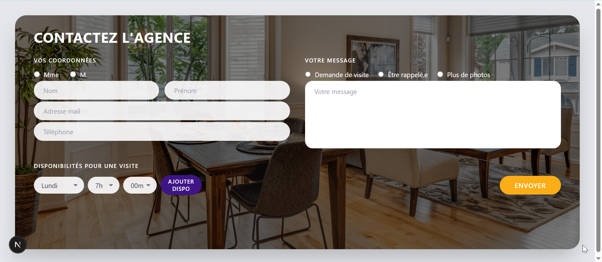
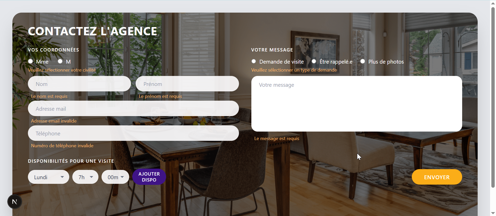
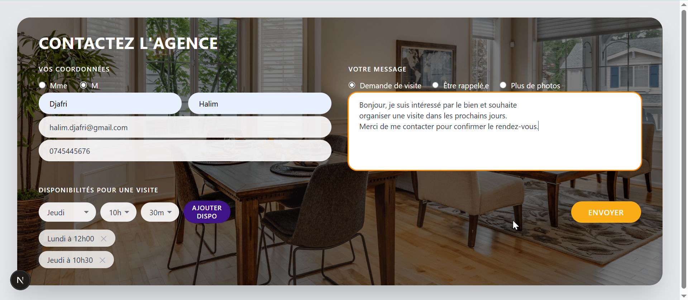
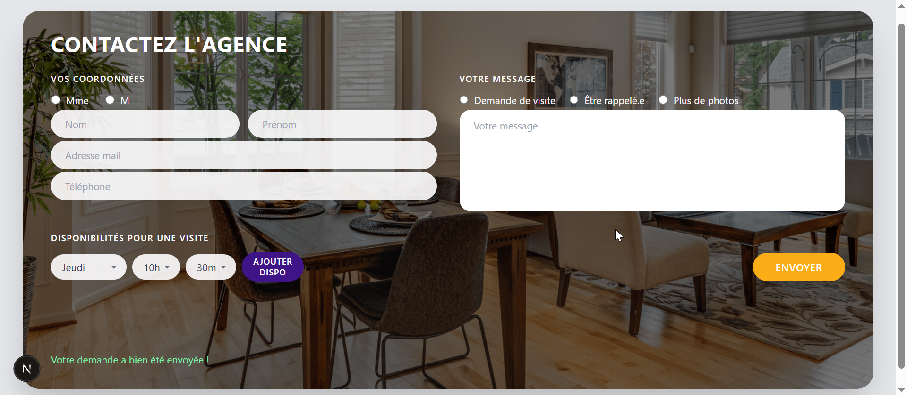

# Test technique

## A propos de moi

| | |
|---|---|
| **Nom / Prénom** | DJAFRI Halim |
| **Formation** | Licence 3 MIAGE(Methodes informatique appliquer a la gestion des entreprise) |
| **Durée de stage souhaitée** | 2 a 3 mois a partir de juin 2026 |
| **Portfelio** | https://halim-djafri.vercel.app/ |
| **LinkedIn** | https://www.linkedin.com/in/halim-djafri/ |

---

##  Screenshots

### Formulaire vide


### Validation — champs obligatoires


### Formulaire rempli


### Confirmation d'envoi


---

##  Stack technique & choix

### Framework
**Next.js 14** — App Router  
Gère le front et le back dans un seul projet (composants React + API routes). Pas besoin d'un serveur Express séparé.

### Base de données
**SQLite + Prisma 7**  
SQLite ne nécessite aucune installation de serveur, la base est un simple fichier `.db`. Prisma génère automatiquement les types TypeScript à partir du schéma.

### Styling
**Tailwind CSS v4**  
Permet de styler directement dans le JSX sans fichier CSS séparé. Idéal pour reproduire une maquette rapidement (border-radius, couleurs, espacements).

### Formulaire
**react-hook-form**  
Gère l'état du formulaire avec un minimum de re-renders. Plus performant qu'une approche `useState` classique sur les formulaires complexes.

### Validation
**Zod**  
Schéma de validation partagé entre le front et le back.

### Driver BDD
**@prisma/adapter-better-sqlite3**  
Adapter obligatoire dans Prisma 7 pour connecter le client à SQLite.

---

## Lancement du projet

### Prérequis
- Node.js 18+
- npm

### Installation

```bash
# 1. Cloner le projet
git clone https://github.com/HalimDjr/majordhom-test.git
cd contact-agence

# 2. Installer les dépendances
npm install

# 3. Créer le fichier d'environnement
# Créer un fichier .env à la racine avec :
# DATABASE_URL="file:./prisma/dev.db"

# 4. Créer la base de données
npx prisma db push

# 5. Lancer le serveur de développement
npm run dev
```

Ouvrir [http://localhost:3000](http://localhost:3000)

### Visualiser la base de données
```bash
npx prisma studio
# Ouvre http://localhost:5555
```

---

##  Questions

### Avez-vous trouvé l'exercice facile ou difficile ?
L'exercice était globalement facile. La seule difficulté rencontrée a été 
la configuration de Prisma 7 qui introduit des changements majeurs par 
rapport aux versions précédentes (nouveau système de driver adapters, 
fichier prisma.config.ts, suppression de l'URL dans schema.prisma). 


### Avez-vous appris de nouveaux outils ?
Oui, j'ai découvert Prisma 7 et son nouveau système de driver adapters. 
J'ai aussi rafraîchi mes connaissances en Next.js, React, react-hook-form 
et Zod à travers la réalisation de cet exercice.

### Quelle est la place du développement web dans votre cursus ?
Le développement web occupe une place importante dans mon parcours. 
J'ai un Master 2 en Génie Logiciel au cours duquel j'ai réalisé de 
nombreux projets web. Je poursuis actuellement en L3 MIAGE ou le 
développement web fait également partie intégrante de la formation.

### Avez-vous utilisé un LLM ?
Oui j'ai utilisé Claude principalement pour comprendre 
les changements de Prisma 7 et déboguer certains erreurs rencontrées.

---

##  Structure du projet

```
src/
├── app/
│   ├── api/contact/route.ts   # Route API POST — enregistrement en BDD
│   ├── globals.css            # Styles globaux Tailwind
│   ├── layout.tsx             # Layout racine Next.js
│   └── page.tsx               # Page d'accueil
├── components/
│   └── ContactForm.tsx        # Composant formulaire (UI + logique)
└── lib/
    ├── prisma.ts              # Singleton client Prisma
    └── validation.ts          # Schéma de validation Zod partagé
```